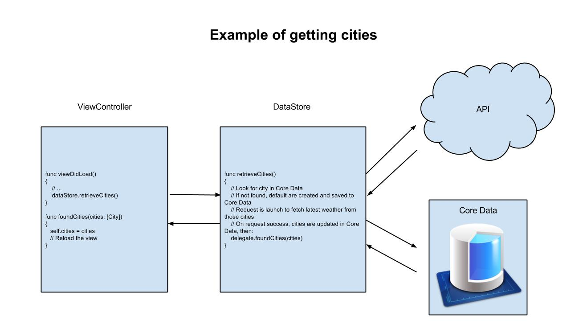

# WayThere
WayThere is a simple yet beautiful weather iOS app

To make sure that the project work, do the following:

```shell
cd WayThere
pod install
open WayThere.xcworkspace
```

Architecture
==========

With iOS, one needs to have ViewControllers to interact with the view elements.  
In addition to that, every ViewController have a DataStore, a simple class that will be the link between the ViewController and the data.  
This class is responsible for all data management, which mean either getting/sending information from/to an API, or deal with the local storage (CoreData for example).  
This way the ViewController is doing only what his name is describing, controlling the view, and for each events, the ViewController will call a function from the DataStore, this one will do what it needs to do (send, receive, store data) then call a function from it's delegate to notice the ViewController that the data is available, or that the action was done with success or error.  

Here is an example of how to get cities:



Troubleshooting
==========

- You may need to change the team to build it on real device.
- Sometimes the openweathermap api return the error `failed to connect` without real pattern. It doesn't crash the app of course, but it can be annoying, just wait a few seconds and click on `Retry`

- Make sure to have the following packages installed in this order:

    * `gem` RubyGems is available [here](https://rubygems.org/pages/download). Make sure to have the latest version:
    ```shell
    gem update --system          # may need to be administrator or root
    ```
    * `pod` [CocoaPods](https://cocoapods.org/) can be installed like this:
    ```shell
    sudo gem install cocoapods
    ```
